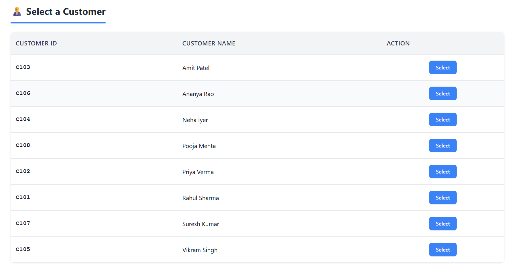
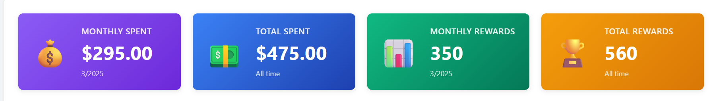
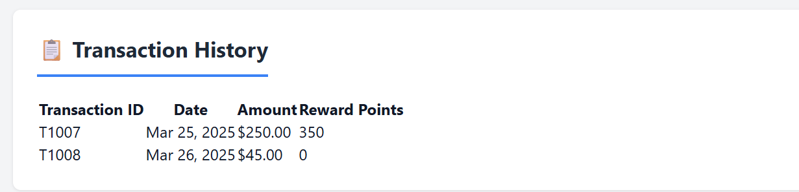

# Customer Rewards Calculator

A production-ready React application for calculating and managing customer reward points based on transaction amounts. Built with modern React practices, clean architecture, and comprehensive testing.

## Table of Contents

- [Features](#features)
- [User Interface](#user-interface)
- [Project Structure](#project-structure)
- [Technical Stack](#technical-stack)
- [Installation](#installation)
- [Available Scripts](#available-scripts)
- [Reward Calculation Logic](#reward-calculation-logic)
- [Component Architecture](#component-architecture)
- [Custom Hooks](#custom-hooks)
- [Utilities & Services](#utilities--services)
- [Testing](#testing)
- [Performance Optimizations](#performance-optimizations)
- [Best Practices](#best-practices)
- [Troubleshooting](#troubleshooting)

## Features

### Core Features
- **Customer Management**: Display and select from a list of customers
- **Transaction History**: View all transactions for selected customer
- **Reward Calculation**: Automatic calculation of reward points based on transaction amounts
- **Month/Year Filtering**: Filter transactions by specific month and year
- **Pagination**: Navigate through large transaction lists
- **Responsive Design**: Mobile-friendly interface
- **Error Handling**: Comprehensive error handling with retry functionality
- **Loading States**: Visual feedback during data loading

### Advanced Features
- **Reusable Components**: Modular component architecture for scalability
- **Custom Hooks**: Optimized hooks for pagination and transaction management
- **Mock API Integration**: Simulated backend API with realistic delays
- **Comprehensive Logging**: Track application events and errors
- **Empty States**: User-friendly empty state messages
- **Unit Testing**: Extensive test coverage for core utilities
- **Clean Code**: Industry-standard practices and naming conventions

## User Interface

### Customer Selection
Browse and select from a list of customers. The selected customer is highlighted in green.



### Reward Summary Cards
Four beautifully styled cards display comprehensive statistics:
- **Monthly Spent** (Purple): Total amount spent in the selected month
- **Total Spent** (Blue): Total amount spent across all transactions
- **Monthly Rewards** (Green): Reward points earned in the selected month
- **Total Rewards** (Orange): Total reward points earned



### Transaction History
View all transactions with pagination. Each transaction shows:
- Transaction ID
- Date (formatted as "MMM DD, YYYY")
- Amount (formatted as currency)
- Automatically calculated Reward Points



## Project Structure

src/
│
├── __tests__/
│   └── rewardCalculator.test.jsx
│
├── components/
│   │
│   ├── customersTable/
│   │   ├── customersTable.jsx
│   │   ├── customersTable.css
│   │   ├── transactionTable.jsx
│   │   ├── transactionRow.jsx
│   │   ├── pagination.jsx
│   │   ├── pagination.css
│   │   ├── emptyState.jsx
│   │   └── emptyState.css
│   │
│   ├── errorPage/
│   │   ├── errorPage.jsx
│   │   └── errorPage.css
│   │
│   ├── filters/
│   │   ├── filters.jsx
│   │   └── filters.css
│   │
│   ├── layout/
│   │   ├── layout.jsx
│   │   └── layout.css
│   │
│   ├── loading/
│   │   ├── loading.jsx
│   │   └── loading.css
│   │
│   └── rewardPointsCard/
│       ├── rewardPointsCard.jsx
│       └── rewardPointsCard.css
│
├── hooks/
│   ├── usePagination.js
│   └── useTransactions.js
│
├── services/
│   └── transactionService.js
│
├── utils/
│   ├── calculateRewardPoints.js
│   ├── dateFormatter.js
│   ├── paginationHelper.js
│   └── logger.js
│
├── constants/
│   └── index.js
│
├── App.jsx
├── App.css
├── index.css
├── main.jsx
└── setupTests.js

## 🛠 Technical Stack

### Frontend Framework
- **React 18.2.0** - UI library with hooks
- **Vite 5.0.0** - Build tool and dev server
- **PropTypes 15.8.1** - Runtime type checking

### Development & Testing
- **Jest 29.7.0** - Testing framework
- **React Testing Library 14.0.0** - Component testing utilities
- **Babel 7.22.0** - JavaScript transpiler

### Build & Development
- **Node.js** - JavaScript runtime
- **npm** - Package manager

## Installation

### Prerequisites
- Node.js (v16 or higher)
- npm (v8 or higher)

### Setup Steps

1. **Clone or navigate to project directory**
   ```bash
   cd Rewards-App
   ```

2. **Install dependencies**
   ```bash
   npm install
   ```

3. **Start development server**
   ```bash
   npm run dev
   ```
   The application will open at `http://localhost:3000`

4. **Build for production**
   ```bash
   npm run build
   ```

5. **Preview production build**
   ```bash
   npm run preview
   ```

## Available Scripts

### Development
```bash
npm run dev
```
Starts the development server with hot module reloading.

### Testing
```bash
npm test
```
Runs tests in watch mode.

```bash
npm run test:coverage
```
Generates test coverage report.

### Production Build
```bash
npm run build
```
Creates optimized production build in `dist/` folder.

```bash
npm run preview
```
Preview production build locally.

## Reward Calculation Logic

### Rules
The application calculates reward points based on the following rules:

| Amount Range | Points | Calculation |
|---|---|---|
| Below $50 | 0 | No points |
| $50 - $100 | 1 per dollar | (amount - 50) × 1 |
| Above $100 | 2 per dollar above $100 + 1 for $50-$100 | (amount - 100) × 2 + 50 |

### Example Calculations

**Purchase of $120:**
```
Amount above $100: ($120 - $100) × 2 = $20 × 2 = 40 points
Amount in $50-$100 range: 50 points (fixed)
Total: 40 + 50 = 90 points
```

**Purchase of $75:**
```
Amount in $50-$100 range: ($75 - $50) × 1 = $25 × 1 = 25 points
Total: 25 points
```

**Purchase of $45:**
```
Amount below $50: 0 points
Total: 0 points
```

### Implementation
See `src/utils/calculateRewardPoints.js` for the complete implementation.

## Component Architecture

### Layout Structure
```
App (Container)
├── Layout
│   ├── Header
│   ├── Main Content
│   │   ├── Customers Section
│   │   │   └── CustomersTable
│   │   ├── Filters Section
│   │   │   └── Filters
│   │   ├── Rewards Summary
│   │   │   └── RewardPointsCard (x2)
│   │   └── Transactions Section
│   │       └── TransactionTable
│   │           ├── TransactionRow (x10)
│   │           └── Pagination
│   └── Footer
```

### Component Responsibilities

| Component | Purpose | Props |
|---|---|---|
| `App` | Root component, state management | - |
| `Layout` | Main layout wrapper | children |
| `CustomersTable` | Display selectable customers | customers, selectedCustomerId, onSelectCustomer |
| `TransactionTable` | Display paginated transactions | transactions |
| `TransactionRow` | Single transaction display | transaction |
| `Pagination` | Navigation controls | currentPage, totalPages, callbacks |
| `Filters` | Month/year selection | selectedMonth, selectedYear, callbacks |
| `RewardPointsCard` | Reward statistics display | title, points, subtitle, variant, icon |
| `EmptyState` | Empty data display | title, message, icon |
| `Loading` | Loading indicator | - |
| `ErrorPage` | Error display with retry | error, onRetry |

## Custom Hooks

### usePagination Hook
```javascript
const {
  currentPage,
  totalPages,
  paginatedItems,
  goToPage,
  goToPreviousPage,
  goToNextPage,
  resetPagination,
  canGoPrevious,
  canGoNext,
} = usePagination(items, itemsPerPage);
```

**Features:**
- Manages pagination state
- Provides navigation methods
- Prevents out-of-bounds navigation
- Calculates paginated items automatically

### useTransactions Hook
```javascript
const {
  transactions,
  customers,
  status,
  error,
  getTransactionsForCustomer,
  retryLoadTransactions,
  isLoading,
  isError,
  isSuccess,
} = useTransactions();
```

**Features:**
- Loads transactions on mount
- Extracts unique customers
- Provides retry functionality
- Maintains loading/error states

## Utilities & Services

### Utility Functions

#### calculateRewardPoints.js
- `calculateRewardPoints(amount)` - Calculate points for single transaction
- `calculateMonthlyRewards(transactions, month, year)` - Calculate monthly total
- `calculateTotalRewards(transactions)` - Calculate all-time total

#### dateFormatter.js
- `formatDate(dateString)` - Format date to readable format
- `getMonthName(monthNumber)` - Get month name from number
- `getLastNMonths(n)` - Get last N months with labels

#### paginationHelper.js
- `getPaginatedItems(items, page, itemsPerPage)` - Get page items
- `getTotalPages(totalItems, itemsPerPage)` - Calculate total pages
- `getPageNumbers(currentPage, totalPages, maxButtons)` - Get page buttons

#### logger.js
- `logger.info(message, data)` - Log info messages
- `logger.warn(message, data)` - Log warning messages
- `logger.error(message, data)` - Log error messages

### Service Functions

#### transactionService.js
- `fetchTransactions()` - Mock API call with 1s delay
- `getUniqueCustomers(transactions)` - Extract customers from transactions
- `getCustomerTransactions(transactions, customerId)` - Filter by customer
- `filterByMonthYear(transactions, month, year)` - Filter by date range

## Testing

### Running Tests
```bash
npm test
```

### Test Coverage
```bash
npm run test:coverage
```

### Test File: rewardCalculator.test.jsx

Comprehensive test coverage including:

1. **Positive Cases**
   - Amounts below $50 → 0 points
   - Amounts between $50-$100 → 1 point/dollar
   - Amounts above $100 → 2 points/dollar above + 50 fixed

2. **Decimal Handling**
   - Proper decimal value handling
   - Floor calculation

3. **Edge Cases**
   - Invalid inputs (null, undefined, NaN)
   - Negative amounts
   - String numbers
   - Empty arrays
   - Boundary values

4. **Integration Tests**
   - Multiple transactions
   - Monthly vs total calculations
   - Consistency across methods

### Test Coverage Metrics
- 30+ test cases
- Edge case coverage
- Integration testing
- Positive and negative scenarios

## Performance Optimizations

### React Optimization
1. **useMemo** - Memoized expensive calculations
2. **useCallback** - Stable function references
3. **Functional Components** - Lightweight and efficient
4. **Hooks Only** - Modern React patterns

### Component Optimization
1. **Pagination** - Limits rendered items to 10 per page
2. **Lazy Filtering** - Filters applied only when needed
3. **CSS Modules** - Scoped styling, no global conflicts

### Bundle Optimization
1. **Vite** - Fast build tool with optimizations
2. **Tree Shaking** - Unused code elimination
3. **Code Splitting** - Automatic route-based splitting

## Best Practices

### Code Quality
PropTypes validation on all components
Descriptive function and variable names
Single responsibility principle
DRY (Don't Repeat Yourself)
Proper error handling
Comprehensive logging

### File Organization
Feature-based folder structure
Collocated CSS with components
Centralized utilities and services
Clear separation of concerns

### Documentation
JSDoc comments on functions
Clear prop documentation
README with examples
Code comments for complex logic

## Architecture Explanation

### Data Flow

```
App Component
    ↓
useTransactions Hook (fetch data)
    ↓
Mock API Service (transactionService)
    ↓
JSON Data (public/data/transactions.json)
    ↓
Calculations (calculateRewardPoints)
    ↓
Component Display (Filtered & Paginated)
```

### State Management
- **No Redux**: Using React hooks for state management
- **Local Component State**: useState for component-specific data
- **Custom Hooks**: Encapsulate complex logic
- **Props Drilling**: Minimal, used strategically

### Error Handling
1. **API Errors**: Try-catch in service calls
2. **Validation Errors**: PropTypes and input validation
3. **UI Errors**: Error component with retry
4. **Logging**: All errors logged for debugging

## Troubleshooting

### Common Issues

#### Port Already in Use
```bash
# Kill process on port 3000
# Windows
netstat -ano | findstr :3000
taskkill /PID <PID> /F

# Mac/Linux
lsof -i :3000
kill -9 <PID>
```

#### Dependencies Not Installing
```bash
rm -rf node_modules package-lock.json
npm install
```

#### Tests Failing
```bash
# Clear Jest cache
npm test -- --clearCache
npm test
```

#### Build Issues
```bash
# Clean build
rm -rf dist
npm run build
```

## Responsive Design

The application is fully responsive:
- **Desktop** (1200px+): Full layout with all features
- **Tablet** (768px-1199px): Optimized column layout
- **Mobile** (< 768px): Single column, touch-friendly controls

## Security Considerations

- Input validation on all forms
- PropTypes for type checking
- No sensitive data in logs
- Clean error messages (no stack traces to users)
- No XSS vulnerabilities (React escaping)

## Mock Data

Located in `public/data/transactions.json`:
- 30 transactions
- 10 unique customers
- Multiple transactions per customer
- Spread across 3 months (Jan, Feb, Mar 2025)
- Various transaction amounts

## Deployment

### Production Build
```bash
npm run build
```

### Deploy Dist Folder
The `dist/` folder contains production-ready files ready for deployment to:
- Vercel
- Netlify
- AWS S3
- Azure Static Web Apps
- Traditional web servers

## Learning Resources

- [React Documentation](https://react.dev)
- [Vite Documentation](https://vitejs.dev)
- [Jest Testing](https://jestjs.io)
- [React Testing Library](https://testing-library.com/react)

---